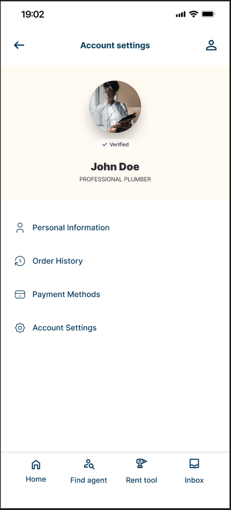

# fluttertest

A new Flutter project.

## Getting Started

this application is to test your knowlage in flutter

1. ## Run the application with the right flutter dependency and SDK.
2. ## create the following page



3. ## the profile data should be populated from this api:

```
{
  "name": "John Doe",
  "profession": "PROFESSIONAL PLUMBER",
  "status": "verified",
  "image": "imageUrl"
}
```
